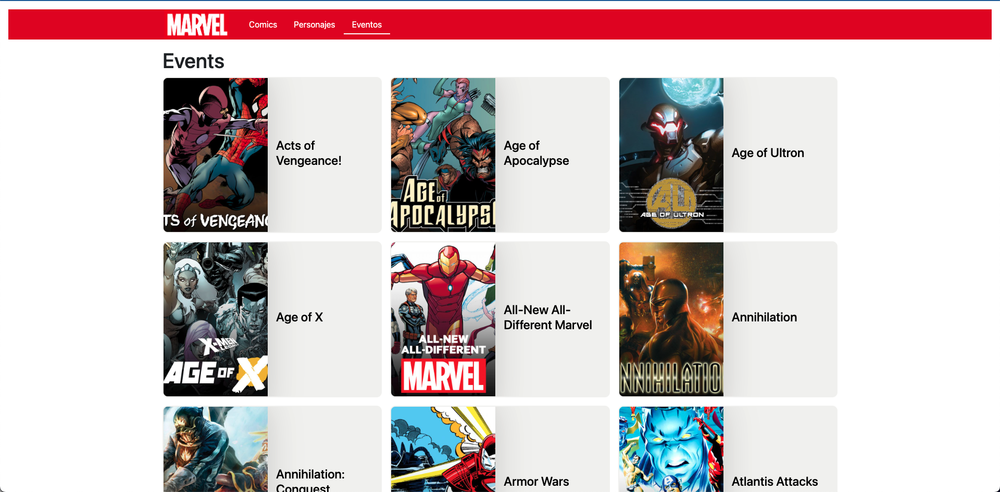

# Marvel Comics App

## Objective

this project aims to show my skills with Vue, Vuex, Vue Router and API connect.

## Views

## Legal

the public api of Marvel comics is used, this project has no other objective than to show my skills with Vue.
