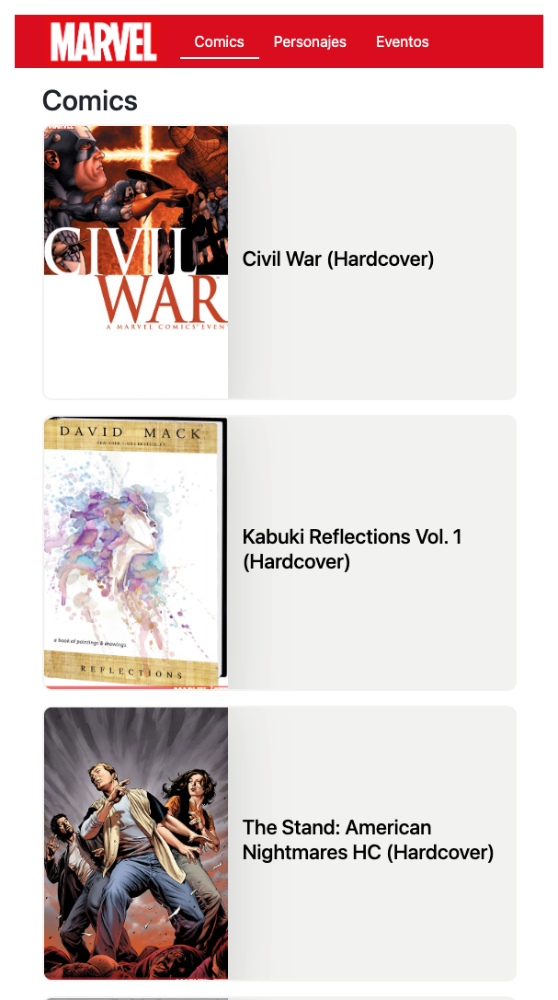

# Marvel Comics App

## Objective

this project aims to show my skills with Vue, Vuex, Vue Router and API connect.

## Run Project

#### 1 Install Node Pakage

##### npm  
```
	npm install
```
##### yarn
```
	yarn install
```
	
####  2 You will need create Marvel account

**Sign Up** in [Developer Marvel.](https://developer.marvel.com/)

After registering, the public key, private key appears, with this you will be able to have permissions to consume the marvel API.


####  3 Insert keys

will create file  **.env.local** at the root of the project 

```
	VUE_APP_PUBLIC_KEY_MARVEL=
	VUE_APP_PRIVATE_KEY_MARVEL=
```

put the values in their proper place

####  3 Run Proyect

```
	npm run serve
```

## Views





## Legal

the public api of Marvel comics is used, this project has no other objective than to show my skills with Vue.
